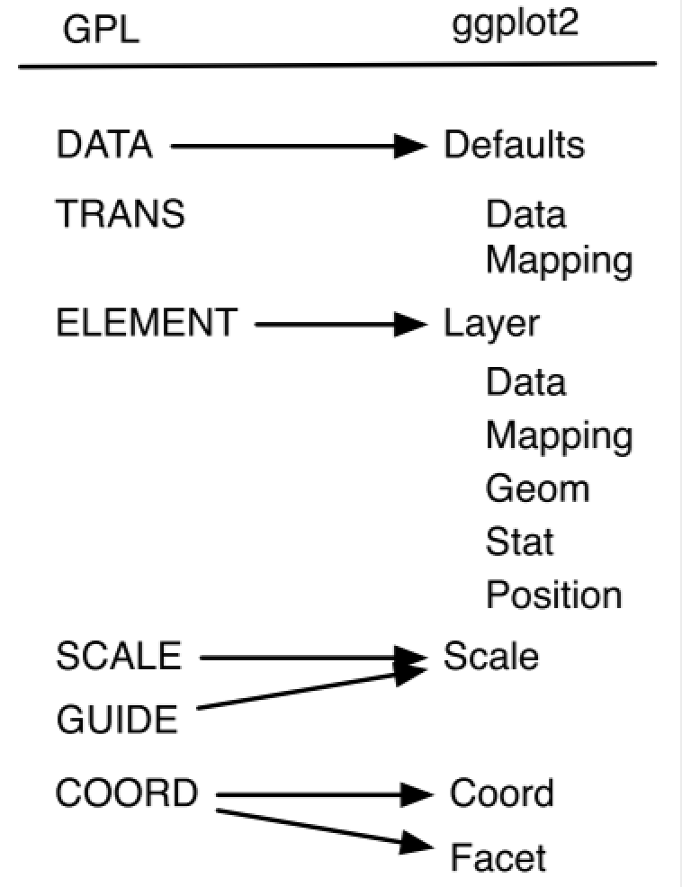
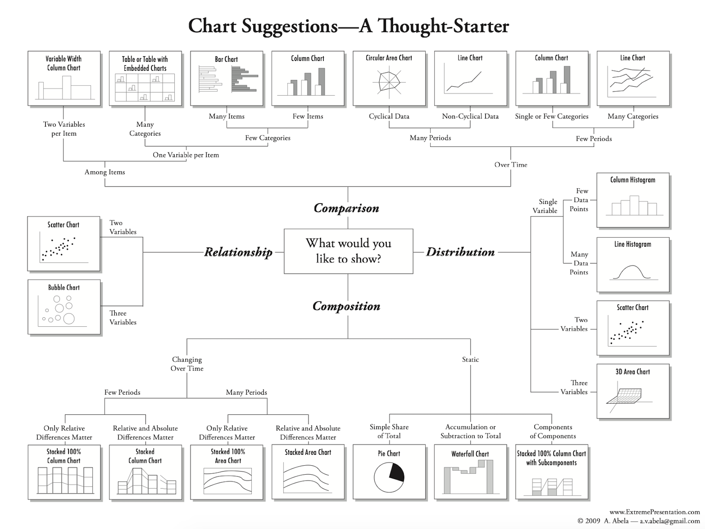

# About Me

- UCLA'16, Statistics

- Data Scientist at System1 & Computational Linguistics MS Student at University of Washington

- Happy R user since STAT 20

- Find me at amy17519 @ Twitter, Github, and LinkedIn

---
# Why is this a "lesser known" intro

You can easily find tutorials if you google "how to use "blah blah" visualization library"
<br />
<br />
(🤭 and just copy and paste code! It works!)

--

You can even build amazing graphs *_without coding_* using Tableau etc
<br />
<br />
(🤭 and they look nice! Nicer than my ggplots sometimes!)

--

<br />
<br />
<br />
🤔... However, having a deeper understanding on visualization tools and process is a great asset for data practitioners

--

🤩 Know behind-the-library design philosophy ➡️ helps you understand a diverse range of graphics and powerful tools faster

--

🤩 Practice visualization process ➡️ inform yourself, then educate your audience


---
# Agenda

- Grammar of Graphics

- Strategy

- Visualization Process 
  - Making *_Exploratory_* Graphs
  - Making *_Confirmatory_* Graphs

- Toolbox

- Resources


---
class: center, middle, inverse

## Grammar of Graphics

---

# The Beauty of Grammar of Graphics

In languages, grammar keeps things in order. 

<br />

--

If you know some grammar, you don't need to know all the vocabularies to speak.

<br />

--
If you know some grammar of graphics, you don't need to know all coding syntax or graph types to make an informative graph


---

# History - Grammar of Graphics

.pull-left[
- Late 1990s: the concept was introduced by Leland Wilkinson. See [The Grammar of Graphics 2nd Edition, 2005](https://www.springer.com/gp/book/9780387245447). 

- 2000s: Hadley Wickham built the R visualization library ggplot2 based on grammar of graphics with modifications. He also published [A Layered Grammar of Graphics, 2010](http://vita.had.co.nz/papers/layered-grammar.html). 

- Many applications in visualization libraries/projects in different languages.
]

.pull-right[

]

---

# Grammar of Graphics - Components of Grammar

.center[

]

---

# Example Data

```{r, eval = TRUE, include = FALSE, warning = FALSE, message = FALSE}
library(dslabs)
library(data.table)
library(ggplot2)
data("us_contagious_diseases")
df_measles <- subset(us_contagious_diseases, disease == "Measles")
setDT(df_measles)
CA_Measles <- subset(df_measles, state == "California" & disease == "Measles")
```


```{r, eval = TRUE, include = TRUE}
# df_measles comes from dataset dslabs::us_contagious_diseases
str(df_measles)
```

```{r, eval = TRUE, include = TRUE}
head(df_measles)
```


---

# Grammar of Graphics

.left-column[
- Data
- Aesthestics
- Geometry
- Stats
- Facets
- Coordinate
- Theme
]

```{r, eval = TRUE, echo = TRUE, warning = FALSE, message = FALSE, out.width = '400px'}
# Annual reported Measles cases in California
ggplot(data = CA_Measles, aes(x = year, y = count)) +
  geom_line()
```


---

# Grammar of Graphics

.left-column[
- **Data**
- **Aesthestics**
- **Geometry**
- Stats
- Facets
- Coordinate
- Theme
]

```{r, eval = TRUE, echo = TRUE, warning = FALSE, message = FALSE, out.width = '400px'}
# Annual reported Measles cases in California
ggplot(data = CA_Measles, aes(x = year, y = count)) +
  geom_line()
```

---

# Grammar of Graphics

.left-column[
- **Data**
- **Aesthestics**
- **Geometry**
- Stats
- Facets
- Coordinate
- Theme
]

.right-column[

#### Data, Aesthestics(for input data), and Geometry are required to make a minimal graph

```r
* ggplot(aes(x = year, y = count)) + 
*  geom_line() 
* ## Error: `data` must be a data frame.... 🤔

ggplot(data = CA_Measles) + 
  geom_line() 
## Error in order(c(1L, 1L, 1L, 1L, 1L, 1L, 1L, 1L, 1L, 1L, 1L, 1L, 1L, 1L,  : 
## argument 3 is not a vector

ggplot(data = CA_Measles, aes(x = year, y = count))
# No error, but you will get an empty ggplot canvas
```
]

---

# Grammar of Graphics

.left-column[
- **Data**
- **Aesthestics**
- **Geometry**
- Stats
- Facets
- Coordinate
- Theme
]

.right-column[

#### Data, Aesthestics(for input data), and Geometry are required to make a minimal graph

```r
ggplot(aes(x = year, y = count)) + 
  geom_line() 
## Error: `data` must be a data frame.... 🤔

* ggplot(data = CA_Measles) + 
*  geom_line() 
* ## Error in order(c(1L, 1L, 1L, 1L, 1L, 1L, 1L, 1L, 1L, 1L, 1L, 1L, 1L, 1L,  : 
* ## argument 3 is not a vector

ggplot(data = CA_Measles, aes(x = year, y = count))
# No error, but you will get an empty ggplot canvas
```
]

---

# Grammar of Graphics

.left-column[
- **Data**
- **Aesthestics**
- **Geometry**
- Stats
- Facets
- Coordinate
- Theme
]

.right-column[

#### Data, Aesthestics(for input data), and Geometry are required to make a minimal graph

```r
ggplot(aes(x = year, y = count)) + 
  geom_line() 
## Error: `data` must be a data frame.... 🤔

ggplot(data = CA_Measles) + 
 geom_line() 
## Error in order(c(1L, 1L, 1L, 1L, 1L, 1L, 1L, 1L, 1L, 1L, 1L, 1L, 1L, 1L,  : 
## argument 3 is not a vector

* ggplot(data = CA_Measles, aes(x = year, y = count))
* # No error, but you will get an empty ggplot canvas
```
]

---

# Different Library, Similar Syntax, Same Basic Components

```r
library(plotly)
plot_ly(CA_Measles, x = ~year, y = ~count, type = 'scatter', mode = 'lines')

library(highcharter)
hchart(CA_Measles, 'line', hcaes(x = year, y = count)
```

---
class: center, middle, inverse

## Strategy

---

.center[



]

---

## Bottomline

- Focus on showing data patterns using an appropriate ~~fancy~~ graph

- *_Informativeness_* >> Clarity >> Aesthestics

- Data visualization could be subjective, but 
<blockquote>
The greatest value of a picture is when it forces us to notice what we never expected to see
.right[-- <cite>John W. Tukey</cite>]
</blockquote>
-- as opposed to what we wanted to confirm.

---
class: center, middle, inverse

## Visualization Process

---

# Making Exploratory Graphs

<blockquote>
to be able to say that we looked one layer deeper, and found nothing, is a definite step forward -- though not as far as to be able to say that we looked deeper and found thus-and-suck
.right[-- <cite>John W. Tukey</cite>]
</blockquote>

- Make LOTS of exploratory graphs, and only present those that can convince yourself and guide the audience through your data analysis

- In this stage, we only care about *_informativeness_*! We will worry about Clarity and Aesthestics in next stage.

---

# Making Exploratory Graphs - Measles

.left-column[
- **Data**
- **Aesthestics**
- **Geometry**
- Stats
- Facets
- Coordinate
- Theme
]

```{r, eval = TRUE, echo = TRUE, warning = FALSE, message = FALSE, out.width = '400px'}
ggplot(data = CA_Measles, aes(x = year, y = count)) +
  geom_line()
```

---

# Making Exploratory Graphs - Measles

.left-column[
- **Data**
- **Aesthestics**
- **Geometry**
- Stats
- **Facets**
- Coordinate
- Theme
]

```{r, eval = TRUE, echo = TRUE, warning = FALSE, message = FALSE, out.width = '400px'}
ggplot(data = df_measles, aes(x = year, y = count)) +
  geom_line() +
  facet_wrap(~state)
```

---

# Making Exploratory Graphs - Measles

.left-column[
- **Data**
- **Aesthestics**
- **Geometry**
- Stats
- Facets
- Coordinate
- Theme
]

```{r, eval = TRUE, echo = TRUE, warning = FALSE, message = FALSE, out.width = '400px'}
df_avg_pop <- df_measles[, .(mean_pop = mean(population, na.rm = TRUE)), state]
ggplot(data = df_avg_pop, aes(x = state, y = mean_pop)) +
  geom_col()
```

---

# Making Exploratory Graphs - Measles

.left-column[
- **Data**
- **Aesthestics**
- **Geometry**
- Stats
- **Facets**
- Coordinate
- Theme
]

```{r, eval = TRUE, echo = TRUE, warning = FALSE, message = FALSE, out.width = '400px'}
ca_wy_noweight <- ggplot(df_measles[state %in% c("California", "Wyoming")], 
                     aes(x = year, y = count)) +
                  geom_line() +
                  facet_wrap(~state)
ca_wy_weighted <- ggplot(df_measles[state %in% c("California", "Wyoming")], 
                     aes(x = year, y = count / (population / 1000000))) +
                  geom_line() +
                  facet_wrap(~state)
```

---

# Making Exploratory Graphs - Measles

.left-column[
- **Data**
- **Aesthestics**
- **Geometry**
- Stats
- **Facets**
- Coordinate
- Theme
]

```{r, eval = TRUE, echo = TRUE, warning = FALSE, message = FALSE, out.width = '400px'}
library(patchwork)
ca_wy_noweight / ca_wy_weighted
```

---

# Making Exploratory Graphs - Measles

.left-column[
- **Data**
- **Aesthestics**
- **Geometry**
- Stats
- **Facets**
- Coordinate
- Theme
]

```{r, eval = TRUE, echo = TRUE, warning = FALSE, message = FALSE, out.width = '400px'}
ggplot(data = df_measles, aes(x = year, y = count / (population / 1000000))) +
  geom_line() +
  facet_wrap(~state)
```

---

# Making Confirmatory Graphs

- Few exploratory graphs need to become confirmatory graphs

- Key findings or evidence in your data analysis that help draw conclusions or inform modeling decisions 

- Now we have the information we want to share, we can work on Clarity and Aesthestics

---

# Making Confirmatory Graphs -- Measles

.left-column[
- **Data**
- **Aesthestics**
- **Geometry**
- Stats
- **Facets**
- **Coordinate**
- **Theme**
]

```{r, eval = TRUE, echo = TRUE, warning = FALSE, message = FALSE, out.width = '350px'}
ggplot(data = df_avg_pop, aes(x = reorder(state, mean_pop), y = mean_pop)) +
  geom_col() + coord_flip() +
  ggtitle("Average US State Population, 1928-2002") +
  scale_y_continuous(labels = scales::comma) +
  xlab("Avg Population") + ylab("State") +
  theme_bw()
```

---

# Making Confirmatory Graphs -- Measles

.left-column[
- **Data**
- **Aesthestics**
- **Geometry**
- Stats
- **Facets**
- **Coordinate**
- **Theme**
]

```{r, eval = TRUE, echo = TRUE, warning = FALSE, message = FALSE, out.width = '350px'}
ggplot(data = df_measles, aes(x = year, y = count / (population / 1000000))) +
  geom_line() + facet_wrap(~state) +
  ggtitle("Measle Cases per Million People by State, 1928-2002") +
  scale_y_continuous(labels = scales::comma) +
  xlab("State") + ylab("Cases/1m Population") +
  theme_bw()
```

---
class: center, middle, inverse

## Toolbox

---

# Visualization Toolbox

- Lots of [ggplot](https://ggplot2.tidyverse.org) extensions
  - [patchwork](https://github.com/thomasp85/patchwork) - arrange and stitch graphs together
  - [gganimate](https://gganimate.com/articles/gganimate.html) - make animated ggplots
  - [ggdendro](https://cran.r-project.org/web/packages/ggdendro/vignettes/ggdendro.html) - make dendrogram in ggplot
  - [ggrepel](https://cran.r-project.org/web/packages/ggrepel/vignettes/ggrepel.html) - display labels nicely
  - [ggradar](https://github.com/ricardo-bion/ggradar) - radar chart
  - [ggmap](https://github.com/dkahle/ggmap) - draw maps
  - [cowplot](https://cran.r-project.org/web/packages/cowplot/vignettes/introduction.html) - arrange graphs to be publication ready
  - [ggiraph](http://davidgohel.github.io/ggiraph/index.html) - make ggplot interactive
  - [ggfacet](https://hafen.github.io/geofacet/) - facet on a map

- Color Palettes
  - [r-color-palettes](https://github.com/EmilHvitfeldt/r-color-palettes)
  - [Wes Anderson Palettes](https://github.com/karthik/wesanderson)
  - [html color codes](https://htmlcolorcodes.com/resources/best-color-palette-generators/) - if you really want to customize

---

# Visualization Toolbox

- [Highcharter](http://jkunst.com/highcharter/)

- [Dygraph](https://rstudio.github.io/dygraphs/)

- [Plotly](https://github.com/ropensci/plotly)

- [leaflet](https://rstudio.github.io/leaflet/) - Interactive maps

- [Altair](https://github.com/altair-viz/altair) - Can show distribution in the highlighted region - Python only

---
class: center, middle, inverse

## Resources

---

# Tutorials, Videos, Books, and Paper

- Liz Sander - [Telling stories with data using the grammar of graphics](https://codewords.recurse.com/issues/six/telling-stories-with-data-using-the-grammar-of-graphics)

- Hadley Wickham - [A Layered Grammar of Graphics](https://byrneslab.net/classes/biol607/readings/wickham_layered-grammar.pdf)

- Thomas Lin Pedersen - [ggplot2 Workshop](https://www.youtube.com/watch?v=h29g21z0a68) (video, 4.5hr tutorials with latest dev updates)

- John W. Tukey - [Exploratory Data Analysis, Preface](https://books.google.com/books/about/Exploratory_Data_Analysis.html?id=UT9dAAAAIAAJ&source=kp_book_description)

- Dipanjan (DJ) Sarkar - [A Comprehensive Guide to the Grammar of Graphics for Effective Visualization of Multi-dimensional Data](https://towardsdatascience.com/a-comprehensive-guide-to-the-grammar-of-graphics-for-effective-visualization-of-multi-dimensional-1f92b4ed4149)
---


class: center, middle, inverse

# Thanks!

Slides created using the R package [**xaringan**](https://github.com/yihui/xaringan).
